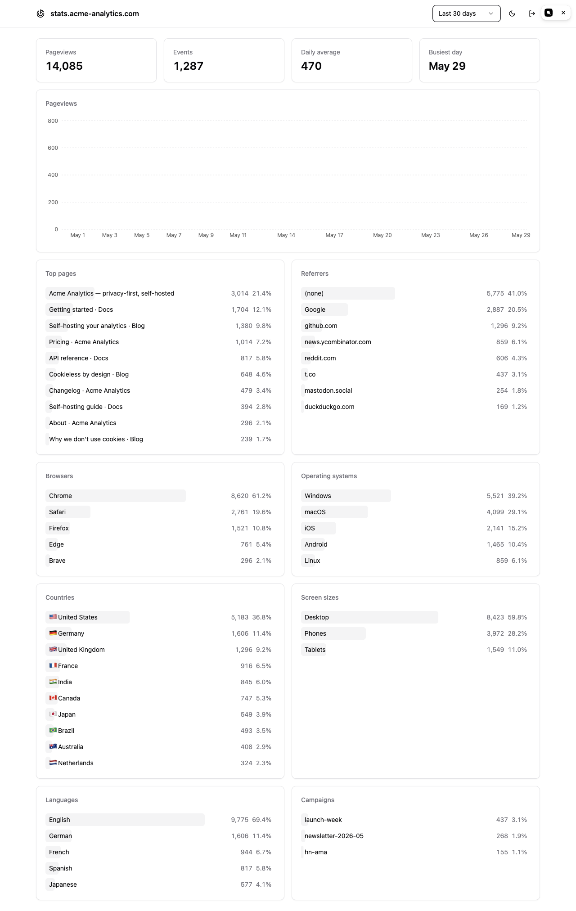

# GoatCounter Dashboard

> A featherweight, zero-runtime web dashboard for self-hosted [GoatCounter](https://github.com/arp242/goatcounter).

[](https://github.com/itsnex1s/goatcounter-dashboard/actions/workflows/ci.yml)


A static, **client-only** analytics dashboard for self-hosted GoatCounter.
No backend, no database, no server process. It builds to a folder of static files
and renders your stats entirely in the browser by calling GoatCounter's API.
**Idle RAM cost on your server: zero.**

<picture>
  <source media="(prefers-color-scheme: dark)" srcset="docs/dashboard-dark.png" />
  
</picture>

<sub>Screenshot uses sample data.</sub>

## Why

GoatCounter is a single ~30 MB Go binary — that's the whole point. A dashboard for
it shouldn't drag in a 150 MB Node server just to draw some charts. This dashboard
keeps the same ethos:

- **Nothing runs at rest.** The dashboard is static HTML/JS/CSS. Serve it from the
  edge you already have (Cloudflare, Caddy, nginx) or next to GoatCounter itself.
  There is no process to idle, leak, or restart.
- **GoatCounter does the work.** All aggregation, GeoIP, and UA parsing already
  happen server-side. The browser only fetches finished numbers and paints them.
- **Small on the wire too.** Lean dependency tree, code-split charts and map, no
  global state library, native `fetch`. Bundle budget is a hard project rule, not
  an afterthought.

## Features

- Overview KPIs + pageviews-over-time chart
- Top pages, referrers, browsers, operating systems, screen sizes, languages,
  and campaigns
- Top countries as a **world map** + a ranked list with flag emojis
- **Click a page** to drill into its referrers
- **Multiple connections** — switch between sites/instances from the header
- Date-range picker, light/dark theme
- Reads GoatCounter's documented `/api/v0/stats/*` API — no coupling to its database
- Ships as static assets: **0 MB resident server RAM**

## How it works

```
┌──────────────────────────┐        Bearer token         ┌──────────────────────┐
│  Browser                 │  ─────────────────────────▶ │  GoatCounter         │
│  Dashboard (static SPA)  │   GET /api/v0/stats/*        │  (your instance)     │
│  served from any host    │  ◀───────────────────────── │  does all the work   │
└──────────────────────────┘        JSON stats           └──────────────────────┘
```

The token lives in the browser's `localStorage` and is sent only to your own
GoatCounter instance. There is no dashboard server in the path.

## Quick start

```sh
pnpm install
pnpm dev            # local dev server
pnpm build          # -> dist/  (static files, deploy anywhere)
pnpm preview        # preview the production build
```

Deploy `dist/` to any static host — an object store, your existing edge
(Cloudflare, Caddy, nginx), or alongside GoatCounter itself.

## Configuration

On first load, paste your GoatCounter **instance URL** and an **API token**
(GoatCounter → *Settings → API*, with the `stats` permission). The URL field
defaults to the current origin, so when the dashboard is served alongside
GoatCounter you only need the token. Credentials are stored in your browser's
`localStorage` and sent only to your own GoatCounter instance.

Add more connections from the header (the **+** button) to switch between several
sites or instances; each connection keeps its own URL + token.

GoatCounter's API already returns `Access-Control-Allow-Origin: *`, so the
dashboard works **cross-origin** out of the box — no proxy needed. Its API is
rate-limited to **4 req/s** by default; the dashboard throttles and retries to
stay within that, but for a snappier multi-widget load you can raise it on your
instance:

```sh
goatcounter serve -ratelimit api:100/1 ...
```

### Serving it as GoatCounter's dashboard

Want `stats.example.com` to show this dashboard instead of GoatCounter's built-in
one (while keeping the `/count` beacon and `/api` working)? See
[docs/DEPLOYMENT.md](./docs/DEPLOYMENT.md) for a small nginx reverse-proxy recipe.

## Tech stack

Vite · React · TypeScript · Tailwind CSS · shadcn/ui · Recharts · react-simple-maps
(lazy-loaded). No backend, no database, no runtime server.

## Non-goals

This dashboard shows what GoatCounter measures — and nothing it can't. GoatCounter
is pageview-centric and cookieless, so there are **no sessions, unique visitors,
bounce rate, visit duration, funnels, retention, journeys, or custom events.** If
you need those, you want a session-based tool like Umami, Plausible, or PostHog —
not GoatCounter, and not this.

## Roadmap

See [PLAN.md](./PLAN.md) for architecture, the RAM/bundle budget, and milestones.

## Contributing

Issues and PRs welcome. The bar for new dependencies is deliberately high — if a
feature can't fit the bundle budget in [PLAN.md](./PLAN.md), it probably belongs in
a fork. Run `pnpm lint` and `pnpm build` before opening a PR.

## License

[MIT](./LICENSE)
